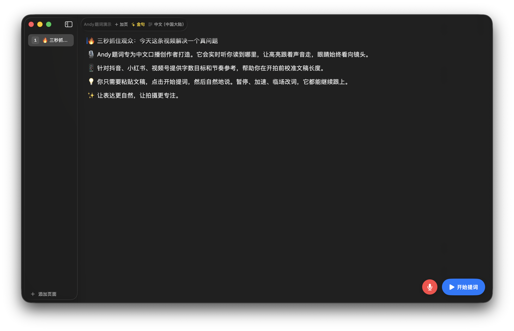

<p align="center">
  
</p>

<h1 align="center">Andy题词</h1>

<p align="center">
  <strong>The teleprompter that follows your voice.</strong><br>
  A native macOS workspace for Chinese video creators on 抖音, 小红书 and 视频号.
</p>

<p align="center">
  <a href="https://github.com/AIPMAndy/andytici/releases"></a>
  
  
  <a href="LICENSE"></a>
</p>

<p align="center">
  <a href="https://github.com/AIPMAndy/andytici/releases/latest"><strong>Download</strong></a>
  &nbsp;·&nbsp;
  <a href="README.zh-CN.md">中文说明</a>
  &nbsp;·&nbsp;
  <a href="https://github.com/AIPMAndy/andytici/issues">Feedback</a>
</p>

<br>

<p align="center">
  
</p>

<p align="center"><sub>Write, organize and rehearse the whole script without leaving the recording flow.</sub></p>

---

## Read at your pace

Most teleprompters scroll on a timer. Speak faster and they fall behind; pause for a thought and they run away.

Andy题词 listens to your speech and moves the highlight with you. You can pause, restart a sentence or improvise without chasing the script. Your eyes stay near the camera and your delivery stays natural.

| | |
| --- | --- |
| **🎙 Voice-following highlight**<br>Chinese speech recognition tracks the current word instead of guessing from elapsed time. | **🧠 Creator vocabulary**<br>Common 口播 phrases such as 点赞、关注、扣1 and 上链接 are supplied as recognition context. |
| **🖥 Camera-friendly layouts**<br>Use the main window, a floating overlay, the MacBook notch area or a connected display. | **🔒 Local-first workflow**<br>No account and no telemetry. Scripts are stored locally as portable `.andytici` documents. |

## From script to camera in three steps

1. **Paste or open your script** — organize longer copy across multiple pages and add visual cue markers where needed.
2. **Choose your reading setup** — tune font, width, placement, scroll behavior and display mode.
3. **Start speaking** — the current phrase stays highlighted while Andy题词 follows your voice.

## Built for Chinese creators

- **Chinese-first recognition** with configurable locale and creator vocabulary hints
- **Multi-page scripts** saved as lightweight `.andytici` bundles
- **Hook templates and cue markers** for emphasis, pauses and key lines
- **Notch, floating and external-display modes** for different camera setups
- **Local browser view and director mode** for another device on the same network
- **macOS Services and URL scheme** for sending selected text from Shortcuts, Raycast, Alfred or another app

### Automation URL

```text
andytici://read?text=今天我们聊一聊...
```

URL-encode multi-line scripts before passing them to `text=`.

---

## Install

Download the newest disk image from [GitHub Releases](https://github.com/AIPMAndy/andytici/releases/latest), open it and drag **Andy题词.app** into `/Applications`.

The current release is ad-hoc signed. On first launch, macOS may ask you to approve it:

1. In Finder, right-click **Andy题词.app** and choose **Open**.
2. Confirm **Open** once more.
3. Grant Microphone and Speech Recognition access when you want voice-following mode.

You only need to approve the app once.

## Build from source

Xcode is optional. The recommended script uses the tools included with Xcode Command Line Tools.

```bash
git clone https://github.com/AIPMAndy/andytici.git
cd andytici/Textream

# Fast local build for Apple Silicon
./build_no_xcode.sh
open build/release/Andy题词.app

# Universal build for Apple Silicon + Intel
./build_no_xcode.sh --universal
```

Requirements:

- macOS 15 or later
- Xcode Command Line Tools (`xcode-select --install`)
- Xcode 16+ only if you prefer building through `Textream.xcodeproj`

The command-line build compiles the Swift sources, assembles the app bundle, generates the icon and applies an ad-hoc signature. See [RELEASE.md](RELEASE.md) for the release checklist.

<details>
<summary><strong>Project map</strong></summary>

```text
andytici/
├── README.md
├── README.zh-CN.md
├── RELEASE.md
├── Casks/
│   └── andytici.rb
├── docs/
│   └── screenshots/
└── Textream/
    ├── Textream/
    │   ├── ContentView.swift
    │   ├── SpeechRecognizer.swift
    │   ├── MarqueeTextView.swift
    │   ├── NotchOverlayController.swift
    │   ├── ExternalDisplayController.swift
    │   ├── BrowserServer.swift
    │   └── DirectorServer.swift
    ├── TextreamTests/
    ├── Textream.xcodeproj/
    └── build_no_xcode.sh
```

</details>

## Current status

The latest public release is **v0.1.1**.

| Area | Status |
| --- | --- |
| Apple Silicon | Built and used on real hardware |
| Intel | Universal binary compiles; not yet tested on an Intel Mac |
| Code signing | Ad-hoc signed; Apple notarization is not yet enabled |
| External display | Implemented; physical second-monitor coverage is still limited |
| Automated tests | XCTest sources exist; no CI runner is configured yet |

These limits are documented openly so users know what has and has not been verified.

## Contributing

Issues and focused pull requests are welcome. For larger changes, open an issue first so the scope can be agreed before implementation.

Please follow the existing SwiftUI structure, keep user-facing copy Chinese-first and avoid adding cloud dependencies to the core reading flow.

## License

Andy题词 is available under the [MIT License](LICENSE).

<p align="center">
  <sub>Made for creators who would rather look at the camera than chase a scrolling script.</sub>
</p>
