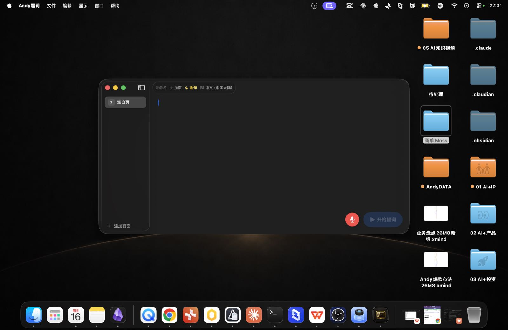

# Andy题词

> **A macOS teleprompter built for Chinese-speaking video creators.**
> Read your script out loud — the app highlights the word you're saying in real time, so you never look away from the camera.

[](https://github.com/AIPMAndy/andytici/releases)
[](https://www.apple.com/macos/)
[](#download)
[](LICENSE)
[](https://github.com/f/textream)

[中文 README](./README.zh-CN.md) · [Releases](https://github.com/AIPMAndy/andytici/releases) · [Issues](https://github.com/AIPMAndy/andytici/issues)

---

<p align="center">
  
</p>

Andy题词 (Andy Tici — "题词" = teleprompter cue) is a native macOS teleprompter designed for **口播 (kǒubō) video creators** on 抖音 / 小红书 / 视频号. It pairs an on-device Chinese speech recognizer with a word-level teleprompter, so the cursor follows your voice — not the other way around.

Forked from [textream](https://github.com/f/textream) by Fatih Kadir Akın and Semih Kışlar (MIT). The Chinese-first adaptation, platform presets, and ASR integration are original work.



---

## Why Andy题词?

| Problem with general teleprompters | How Andy题词 solves it |
| --- | --- |
| English-first ASR; misreads 点赞/扣1/上链接 | On-device `zh-CN` recognizer + 35 cue words injected as `contextualStrings` |
| One-size-fits-all pacing | Platform presets (抖音 / 小红书 / 视频号 / 通用) tune scroll speed, idle threshold, and font size |
| Auto-scroll drifts when you pause or speed up | Word-level highlight tracks the recognizer, not a timer — pause anywhere, speed up, it follows |
| No mirror to a second screen | Built-in external display mirroring via `ExternalDisplayController` |
| Generic toolbar UI | Black-gold palette, Chinese-first Settings, 中文 ASR fallback messages |

---

## Features

### 🎙️ Real-time Chinese ASR follow-along
- On-device `SFSpeechRecognizer` with locale `zh-CN`
- Word-level highlight follows the recognizer's transcription in real time
- Microphone permission handled gracefully — refused? The app opens System Settings for you and falls back to manual scroll
- ~36 常用口播词 (点赞 / 关注 / 扣1 / 上链接 / 福利 / 家人们 / 姐妹们 / 抖音 / 小红书 …) injected as `contextualStrings` for higher accuracy on voice-over-style scripts

### 📱 Platform presets
Switch platforms in the toolbar — each preset overrides the recommended scroll speed, idle threshold, and font size:

| Platform | Default scroll | Idle threshold | Best for |
| --- | --- | --- | --- |
| 抖音 | 280 字/min | 1.2 s | Fast-paced hooks |
| 小红书 | 240 字/min | 1.5 s | Lifestyle / tutorial |
| 视频号 | 220 字/min | 1.8 s | Thoughtful commentary |
| 通用 | 240 字/min | 1.5 s | Mixed content |

### ⛶ Display modes
- **Window** — main editor + side panel + floating controls
- **Full screen** — system full-screen with edge-to-edge script view, control overlay only on hover
- **Notch overlay** — small floating panel for the macOS notch area (MacBook Pro 14"/16")
- **External display** — mirror the current page onto a connected display for camera-mounted teleprompter rigs

### 🔗 URL scheme
Drop a script into Andy题词 from any app that supports URL actions:

```
andytici://read?text=今天我们聊一聊...
andytici://read?text=<urlencoded-multi-line-script>
```

Receiving apps include Raycast, Alfred, Shortcuts, and any browser `javascript:` URL.

### 🎯 macOS Services integration
Select any text in any app → 右键 → 服务 → 在 Andy题词 中朗读。The selected text becomes a new page.

### 🛠 Fully local
No telemetry, no cloud account, no update server. All scripts are saved as `.andytici` bundles locally.

---

## Download

The latest universal binary (Apple Silicon + Intel) lives in [Releases](https://github.com/AIPMAndy/andytici/releases):

| File | Size | Format |
| --- | --- | --- |
| `Andy题词_0.1.1_universal.dmg` | ~4 MB | Apple Disk Image (UDZO compressed) |

### Install

1. Open the `.dmg`
2. Drag **Andy题词.app** into `/Applications`
3. **First launch** — macOS will block the app because it's ad-hoc signed (no Apple Developer ID). Bypass with one of:
   - **Right-click** the app in Finder → **打开** → **打开** (confirm)
   - Or: System Settings → Privacy & Security → scroll down → "Andy题词 was blocked" → **仍要打开**

   You only need to do this once. Subsequent launches work normally.

4. Grant **Microphone** permission when prompted — this is required for the ASR follow-along mode. The app degrades gracefully if you decline.

> **Note on code signing.** v0.1.1 ships ad-hoc signed (Apple Developer ID enrollment is pending). Future releases will add notarization once the Apple Developer Program is set up. See [Known Limitations](#known-limitations).

---

## Build from source

No Xcode required — `swiftc` + `lipo` + `iconutil` + `codesign` are all in the Command Line Tools.

### Prerequisites
- macOS 15.0+ host
- Xcode Command Line Tools (`xcode-select --install`)
- `gh` CLI (for releases only)
- `sips` + `iconutil` (preinstalled)

### One-shot build (arm64)

```bash
git clone https://github.com/AIPMAndy/andytici.git
cd andytici/Textream
./build_no_xcode.sh                 # arm64 only — fastest
open build/release/Andy题词.app
```

### Universal binary (arm64 + x86_64)

```bash
./build_no_xcode.sh --universal
open build_universal/release/Andy题词.app
```

Output: a fat `Mach-O` (verified via `lipo -info`: `Architectures in the fat file: x86_64 arm64`), an `.icns` compiled from `Assets.xcassets` via `iconutil`, and an ad-hoc `codesign --sign -`.

### Build pipeline (what the script does)

1. Compiles all 25 Swift sources with `swiftc -target arm64-apple-macos15.0`
2. Hand-assembles `Contents/Info.plist`, `Contents/MacOS/`, `Contents/Resources/`
3. Skips `Assets.car` (no `actool` without Xcode) — app uses the system icon, but `AppIcon.icns` is generated separately and bundled
4. `codesign --force --sign - --timestamp=none` (ad-hoc, with entitlements so mic + network actually work)
5. With `--universal`, repeats for `x86_64` and merges with `lipo -create`

For a deeper release runbook, see [RELEASE.md](RELEASE.md).

---

## Project structure

```
andytici/
├── README.md                    # This file (English)
├── README.zh-CN.md              # Chinese
├── LICENSE                       # MIT
├── RELEASE.md                    # Maintainer runbook (no-Xcode build)
├── Casks/
│   └── andytici.rb               # Homebrew Cask formula
├── docs/
│   ├── screenshots/
│   │   ├── main-window.jpg       # Main editor view
│   │   └── dock-with-new-logo.jpg
│   └── superpowers/              # Original spec & implementation plan
├── scripts/
│   └── qa_script.andytici        # 60-90s Chinese sample script for QA
└── Textream/                     # Swift sources + build artifacts
    ├── Textream/                 # 25 Swift files (10,246 LoC)
    │   ├── TextreamApp.swift
    │   ├── ContentView.swift
    │   ├── SpeechRecognizer.swift
    │   ├── PlatformPreset.swift  # 抖音/小红书/视频号/通用
    │   ├── MarqueeTextView.swift
    │   ├── NotchOverlayController.swift
    │   ├── ExternalDisplayController.swift
    │   ├── TextreamService.swift
    │   ├── … (17 more)
    │   └── Assets.xcassets/      # 10 PNG sizes for AppIcon
    ├── Textream.xcodeproj/        # Xcode project (for those who prefer GUI)
    ├── TextreamTests/             # XCTest target (not run in CI)
    ├── build_no_xcode.sh         # Command Line Tools build (recommended)
    ├── build.sh                  # Legacy Xcode build script
    └── build_universal/           # Universal output (gitignored)
```

---

## Roadmap

| Version | Status | Focus |
| --- | --- | --- |
| v0.1.0 | ✅ Released | Core teleprompter + Chinese ASR + platform presets |
| **v0.1.1** | ✅ **Current** | Full 中文 UI (NSAlert / 菜单 / Settings / Overlay), new logo, universal binary, no-Xcode build |
| v0.2 | Planned | Script snippet library, multi-platform tone rewrites |
| v0.3 | Planned | AI assist (Hook generation, emoji tag suggestions, voiceover polish) |
| v1.0 | Planned | Cross-device: iPad / iPhone remote, Apple Watch page-turn, full Apple notarization |

---

## Known limitations

These are honestly listed in the [release acceptance doc](V0.1.1_RC2_ACCEPTANCE.md) — none are blockers for personal use:

- **Ad-hoc signed** — other users must right-click → Open the first time. Apple Developer ID notarization requires the $99/yr Apple Developer Program, which the maintainer hasn't enrolled in.
- **Intel Mac not machine-tested** — the universal binary is verified via `lipo` and `swiftc -target x86_64-apple-macos15.0`, but only Apple Silicon hardware is available for end-to-end testing.
- **External display mode** — code is in place but not tested against a physical second monitor (no monitor available on the test machine).
- **Director mode (跨设备遥控)** — code path exists, but no real iOS device was available for cross-device testing.
- **CI test suite** — `TextreamTests` exists but isn't run in CI (requires Xcode test runner, which the maintainer doesn't have installed).

---

## Contributing

Issues and PRs welcome. For substantial changes, please open an issue first to discuss scope.

**Localization** — currently `zh-CN` only. Other locales inherit from the upstream textream project.

**Build prerequisites** — macOS host. Apple Silicon strongly preferred (Intel builds work but aren't machine-tested).

**Code style** — match the existing files: SwiftUI for views, `@MainActor` for UI entry points, MVVM-ish separation. Keep the Chinese-first UI strings in `Localizable.strings` (when added) rather than hard-coded.

---

## Acknowledgments

- [textream](https://github.com/f/textream) — the original macOS teleprompter by **Fatih Kadir Akın** and **Semih Kışlar** (MIT). Andy题词 is a fork.
- All Chinese-first adaptations, platform presets, and ASR integration are original work by the maintainer.

## License

[MIT](LICENSE) — same as upstream textream.